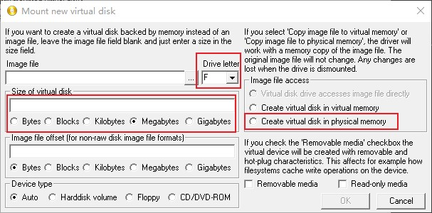

# 回放

本框架的回放功能的对象名称为 `aReplay`， 当然你也可以使用类 `AReplay` 创建回放对象

关键接口如下

```C++

// 开始记录
// 使用示例：
// StartRecord(); ------- 开始记录，默认每 10 帧记录一次，默认从序号为 0 的存档开始记录
// StartRecord(3, 4); ------- 开始记录，每 3 帧记录一次，并且从序号为 4 的存档开始记录
void StartRecord(int interval = 10, int startIdx = 0);

// 开始播放
// 使用示例：
// StartPlay(); -------- 开始播放，默认每 10 帧播放一帧，默认从第 0 帧开始播放，默认正向播放，
// StartPlay(3, 100, AReplay::BACKWARD); -------- 开始播放，每 3 帧播放一帧，从第 100 帧开始播放，反向播放
// StartPlay(3, 100, AReplay::FORWARD); -------- 开始播放，每 3 帧播放一帧，从第 100 帧开始播放，正向播放
void StartPlay(int interval = 10, int startIdx = 0, Direction direction = FORWARD);

// 播放设定的帧
// 使用示例：
// PlayOneTick(55) ----- 播放第 55 帧
bool PlayOneTick(int tick);

// 设定是否使用游戏的刷新函数补帧
// 使用示例：
// SetInterpolate(true) ------ 使用补帧，游戏更加流畅但是可能会导致数据不一致的现象
// SetInterpolate(false) ------ 不使用补帧，每帧播放的都是实际记录的帧但是可能会导致游戏播放不流畅
void SetInterpolate(bool isInterpolate) { _isInterpolate = isInterpolate; }

// 设置是否显示提示信息
// 使用示例：
// SetShowInfo(true) ------- 显示提示信息
// SetShowInfo(false) ------- 不显示提示信息
void SetShowInfo(bool isShowInfo) { _isShowInfo = isShowInfo; }

// 设置提示信息的位置
// 使用示例：
// SetInfoPos(100, 100) ----- 将信息显示的位置设置在游戏窗口的 (100, 100) 处
void SetInfoPos(int x, int y);

// 设置存档文件的保存路径
// 注意存档文件可能会非常大
// 请注意硬盘的容量
void SetSavePath(const std::string& path);

// 设置最大保存帧数
// 注意：如果不使用此函数，回访对象的默认值为 2000
// 使用示例：
// SetMaxSaveCnt(1000); ------- 最大保留 1000 帧存档
void SetMaxSaveCnt(int maxSaveCnt) { _maxSaveCnt = maxSaveCnt; }

// 得到目前播放的帧位
int GetPlayIdx() { return _playIdx; }
```

我们知道这些接口之后就看一下下面的这个示例


```C++
#include <avz.h>

void AScript()
{
    // 阵型选择经典十二炮

    ASetReloadMode(AReloadMode::MAIN_UI_OR_FIGHT_UI);
    ASetZombies({
        ACG_3,  // 撑杆
        ATT_4,  // 铁桶
        ABC_12, // 冰车
        AXC_15, // 小丑
        AQQ_16, // 气球
        AFT_21, // 扶梯
        ATL_22, // 投篮
        ABY_23, // 白眼
        AHY_32, // 红眼
        ATT_18, // 跳跳
    });
    ASelectCards(
        {
            AICE_SHROOM,   // 寒冰菇
            AM_ICE_SHROOM, // 模仿寒冰菇
            ACOFFEE_BEAN,  // 咖啡豆
            ADOOM_SHROOM,  // 毁灭菇
            ALILY_PAD,     // 荷叶
            ASQUASH,       // 倭瓜
            ACHERRY_BOMB,  // 樱桃炸弹
            ABLOVER,       // 三叶草
            APUMPKIN,      // 南瓜头
            APUFF_SHROOM,  // 小喷菇
        },
        1);

    // 设置一下回放文件的存放路径
    // 这里改成自己机器上的路径
    // 可以配合 ImDisk 使用，体验更加
    aReplay.SetSavePath("R:\\");
    aReplay.StartRecord();

    // 播放之前必须先 Stop
    AConnect('W', [] {
        aReplay.Stop();
        aReplay.StartPlay();
    });

    // 暂停播放或者录制
    AConnect('E', [] {
        if (aReplay.IsPaused()) {
            aReplay.GoOn();
        } else {
            aReplay.Pause();
        }
    });

    // 停止回放对象的工作
    AConnect('R', [] {
        aReplay.Stop();
    });

    // 播放下一帧
    AConnect('S', [] {
        aReplay.Pause();
        aReplay.PlayOneTick(aReplay.GetPlayIdx() + 1);
    });

    // 播放上一帧
    AConnect('A', [] {
        aReplay.Pause();
        aReplay.PlayOneTick(aReplay.GetPlayIdx() - 1);
    });

    AConnect(ATime(1, -599), [] {
        aCobManager.AutoGetList();
    });

    // P6
    // 主体节奏
    for (auto wave : {1, 2, 3, 4, 5, 6, 7, 8, 9, 11, 12, 13, 14, 15, 16, 17, 18, 19}) {
        AConnect(ATime(wave, 341 - 373), [] {
            aCobManager.Fire({{2, 9}, {5, 9}});
        });
    }

    // wave 9 19 20的附加操作
    // 收尾发四门炮
    for (auto wave : {9, 19, 20}) {
        AConnect(ATime(wave, 300), [] {
            aCobManager.RecoverFire({{2, 9}, {5, 9}, {2, 9}, {5, 9}});
        });
    }

    // wave 10 的附加操作
    // 樱桃消延迟
    // 解决僵尸出生点靠右的问题
    AConnect(ATime(10, 341 - 100), [] {
        ACard(ACHERRY_BOMB, 2, 9);
    });
    AConnect(ATime(10, 341 - 373), [] {
        aCobManager.Fire({{2, 9}, {5, 9}});
    });

    // wave 20 的附加操作
    // 咆哮珊瑚(炮消)
    // 解决僵尸出生点靠右的问题

    AConnect(ATime(20, 250 - 378), [] {
        aCobManager.Fire(4, 7.625);
    });
    AConnect(ATime(20, 341 - 373), [] {
        aCobManager.Fire({{2, 9}, {5, 9}});
    });
}
```

在上面这个示例中，回放配合跳帧，帮助我们很快的定位了阵型被破的原因，这就是回放的主要作用。
当然你也可以使用回放功能做更多其它的事情。

下面再介绍一下回放功能的优化，因为回放功能本身是借助疯狂存档读档实现的，
而硬盘是计算机中最慢的一个设备了，所以会非常影响游戏的执行速度，一个解决方法是用内存模拟硬盘，
由于内存的读写速度是很快的，那么就会提高执行的速度，这里介绍一个这样的工具：

https://sourceforge.net/projects/imdisk-toolkit/files/latest/download

我们下载完成这个工具之后先解压，然后进入解压之后的文件夹，点击 install.bat


然后选择一下安装目录点击安装就行。然后点击桌面上的 ImDisk Virtual Disk Driver 图标，
弹出的界面如下：


然后点击 Mount new 按钮



注意三个红框，最上面的红框是生成的虚拟硬盘的盘符，这个很重要，下面就是指定虚拟硬盘的容量，
这个需要根据自己的内存条容量进行选择，1GB 大概可以容纳 1600 帧存档，如果 10 帧一存，
那么就是可以存 2.6 分钟的游戏时间，是的，你没看错，1G 内存只能存储 2.6 分钟的游戏时间，
并且还不是每帧都存，所以一定要注意自己的硬件设备的参数。
当然这些数据都只是用来参考的，最后还得是自己根据设备的参数进行调整。
然后点击 OK 之后在按照提示格式化就行。
最后咱们把 aReplay 的保存路径设置为咱们用内存虚拟出来的硬盘即可。

```C++
// 由于 F 盘是内存虚拟出来的，所以读写会快很多
// 注意 ImDisk 用内存虚拟出来的硬盘电脑开关机数据会丢失，并且盘符可能会发生变化
aReplay.SetSavePath("F:\\");
```

[目录](./0catalogue.md) 