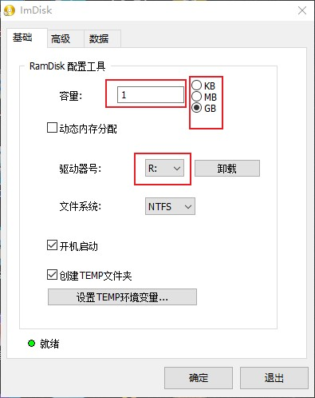

# 回放


## 基本使用
本框架的回放功能的对象名称为 `aReplay`， 当然你也可以使用类 `AReplay` 创建回放对象

关键接口如下

```C++
// 开始记录
// 使用示例：
// StartRecord(); ------- 开始记录，默认每 10 帧记录一次，默认从序号为 0 的存档开始记录
// StartRecord(3, 4); ------- 开始记录，每 3 帧记录一次，并且从序号为 4 的存档开始记录
void StartRecord(int interval = 10, int64_t startIdx = 0);

// 开始播放
// 使用示例：
// StartPlay(); -------- 开始播放，默认每 10 帧播放一帧，默认从第 0 帧开始播放
// StartPlay(3, 100); -------- 开始播放，每 3 帧播放一帧，从第 100 帧开始播放
void StartPlay(int interval = 10, int64_t startIdx = 0);

// 显示设定的帧
// 注意: 对于播放模式，此函数会将播放的帧位设置为当前要显示的帧
//      对于记录模式，此函数会将下一个记录的帧位设置为当前要显示的帧
// 使用示例：
// ShowOneTick(55) ----- 显示第 55 帧
bool ShowOneTick(int64_t tick);

// 设定是否使用游戏的刷新函数补帧
// 使用示例：
// SetInterpolate(true) ------ 使用补帧，游戏更加流畅但是可能会导致数据不一致的现象
// SetInterpolate(false) ------ 不使用补帧，每帧播放的都是实际记录的帧但是可能会导致游戏播放不流畅
void SetInterpolate(bool isInterpolate) { _isInterpolate = isInterpolate; }

// 设置是否显示提示信息
// 使用示例：
// SetShowInfo(true) ------- 显示提示信息
// SetShowInfo(false) ------- 不显示提示信息
void SetShowInfo(bool isShowInfo) { _isShowInfo = isShowInfo; }

// 设置提示信息的位置
// 使用示例：
// SetInfoPos(100, 100) ----- 将信息显示的位置设置在游戏窗口的 (100, 100) 处
void SetInfoPos(int x, int y);

// 设置存档文件的保存路径
// 注意存档文件可能会非常大
// 请注意硬盘的容量
void SetSaveDirPath(const std::string& path);

// 设置最大保存帧数
// 注意：如果不使用此函数，回放对象的默认值为 2000
// 使用示例：
// SetMaxSaveCnt(1000); ------- 最大保留 1000 帧存档
void SetMaxSaveCnt(int64_t maxSaveCnt);

// 设置每个包含有多少帧
// 注意：如果不使用此函数，回放对象的默认值为 100
// 使用示例：
// SetPackTickCnt(100); ------- 每个包含有 100 帧存档
void SetPackTickCnt(int packTickCnt);

// 得到目前播放的帧位
int64_t GetPlayIdx() const { return _playIdx; }

// 得到帧尾位置
int64_t GetEndIdx() const { return _endIdx; }

// 得到要记录的帧位
// 实际上同 GetEndIdx()
int64_t GetRecordIdx() const { return _endIdx; }

// 得到帧头位置
int64_t GetStartIdx() const { return _startIdx; }

// 设置压缩对象
void SetCompressor(AAbstractCompressor& compressor);

// 此函数会立即保存当前 pvz 的状态
// 当 回放对象 停止播放时会将 pvz 的状态恢复到此函数保存的状态
void SavePvzState();

void Pause();
bool IsPaused();
void GoOn();
void Stop();
State GetState() const { return _state; }
APainter& GetPainter() { return _painter; }
```

我们知道这些接口之后就看一下下面的这个示例


```C++
#include <avz.h>

AOnAfterInject(AEnterGame());

void AScript()
{
    // 阵型选择经典十二炮
    ASetReloadMode(AReloadMode::MAIN_UI_OR_FIGHT_UI);
    ASetZombies({
        ACG_3,  // 撑杆
        ATT_4,  // 铁桶
        ABC_12, // 冰车
        AXC_15, // 小丑
        AQQ_16, // 气球
        AFT_21, // 扶梯
        ATL_22, // 投篮
        ABY_23, // 白眼
        AHY_32, // 红眼
        ATT_18, // 跳跳
    });
    ASelectCards(
        {
            AICE_SHROOM,   // 寒冰菇
            AM_ICE_SHROOM, // 模仿寒冰菇
            ACOFFEE_BEAN,  // 咖啡豆
            ADOOM_SHROOM,  // 毁灭菇
            ALILY_PAD,     // 荷叶
            ASQUASH,       // 倭瓜
            ACHERRY_BOMB,  // 樱桃炸弹
            ABLOVER,       // 三叶草
            APUMPKIN,      // 南瓜头
            APUFF_SHROOM,  // 小喷菇
        },
        1);

    // 设置一下回放文件的存放路径
    // 这里改成自己机器上的路径
    // 可以配合 ImDisk 使用，体验更加
    aReplay.SetSaveDirPath("R:\\");
    aReplay.SetMaxSaveCnt(1000);
    aReplay.StartRecord();

    // 播放之前必须先 Stop
    AConnect('W', [] {
        aReplay.Stop();
        aReplay.StartPlay();
    });

    // 暂停播放或者录制
    AConnect('E', [] {
        if (aReplay.IsPaused()) {
            aReplay.GoOn();
        } else {
            aReplay.Pause();
        }
    });

    // 停止回放对象的工作
    AConnect('R', [] {
        aReplay.Stop();
    });

    // 播放下一帧
    AConnect('S', [] {
        aReplay.Pause();
        aReplay.ShowOneTick(aReplay.GetPlayIdx() + 1);
    });

    // 播放上一帧
    AConnect('A', [] {
        aReplay.Pause();
        aReplay.ShowOneTick(aReplay.GetPlayIdx() - 1);
    });

    ASkipTick([] {
        auto ptrs = AGetPlantPtrs({{1, 5}, {2, 5}, {5, 5}, {6, 5}}, AYMJNP_47);
        for (auto ptr : ptrs) {
            if (ptr == nullptr) {
                return false;
            }
        }
        return true;
    });
}
```

在上面这个示例中，回放配合跳帧，帮助我们很快的定位了阵型被破的原因，这就是回放的主要作用，
当然你也可以使用回放功能做更多其它的事情。

下面再介绍一下回放功能的优化，因为回放功能本身是借助疯狂存档读档实现的，
而硬盘是计算机中最慢的一个设备了，所以会非常影响游戏的执行速度，一个解决方法是用内存模拟硬盘，
由于内存的读写速度是很快的，那么就会提高执行的速度，这里介绍一个这样的工具：

https://sourceforge.net/projects/imdisk-toolkit/files/latest/download

我们下载完成这个工具之后先解压，然后进入解压之后的文件夹，点击 install.bat


然后选择一下安装目录点击安装就行。然后点击桌面上的 `RamDisk 设置` 图标，
弹出的界面如下：




注意三个红框，上面两个红框就是指定虚拟硬盘的容量，这个需要根据自己的内存条容量进行选择，
1GB 大概可以容纳 1600 帧存档，如果 10 帧一存，
那么就是可以存 2.6 分钟的游戏时间，是的，你没看错，1G 内存只能存储 2.6 分钟的游戏时间，
并且还不是每帧都存，所以一定要注意自己的硬件设备的参数。
当然这些数据都只是用来参考的，最后还得是自己根据设备的参数进行调整。
最下面的红框是生成的虚拟硬盘的盘符，这个很重要，
然后点击确定之后在按照提示格式化就行。
最后咱们把 aReplay 的保存路径设置为咱们用内存虚拟出来的硬盘即可。

```C++
// 由于 R 盘是内存虚拟出来的，所以读写会快很多
// 注意 ImDisk 用内存虚拟出来的硬盘电脑开关机数据会丢失，并且盘符可能会发生变化
aReplay.SetSavePath("R:\\");
```

## 压缩存档
此功能不建议和跳帧联合使用，此功能是为了避免存档过大的问题，但是会消耗 CPU 的性能，
所以它应用于 **原始倍速下进行录制的功能**，使用压缩功能，可以使得存档的体积大幅降低，
使用示例如下

```C++
// 创建一个压缩对象
// 这里使用 AvZ 封装好的 7z 压缩对象
// 构造函数需要传进去 7z 可执行文件的路径
A7zCompressor compressor("D:\\AsmVsZombies\\7z\\7z.exe");

void AScript() {
    // 将此压缩对象注册给 aReplay
    aReplay.SetCompressor(compressor);

    // 其他代码
}

```

上述代码就完成了回放使用压缩的功能，如果觉得 AvZ 自带的 7z 压缩对象性能太低，可以自定义自己的压缩对象，
需要做的东西就是继承压缩对象抽象类，其定义如下

```C++
class AAbstractCompressor {
public:
    struct Info {
        std::string srcPath;
        std::string dstPath;
    };
    void SetFilePath(const std::string& filePath) { _filePath = filePath; };
    // 压缩文件
    virtual void Compress(const std::string& srcPath) = 0;
    // 解压文件
    virtual void Decompress(const std::string& srcPath, const std::string& dstPath) = 0;
    // 得到正在压缩的文件列表
    virtual std::vector<std::string> GetCompressingList() = 0;
    // 得到正在解压的文件列表
    virtual std::vector<Info> GetDecompressingList() = 0;
    // 得到已经压缩的文件列表，注意对象内部应该删除已经获取的文件列表
    virtual std::vector<std::string> GetCompressedList() = 0;
    // 得到已经解压的文件列表，注意对象内部应该删除已经获取的文件列表
    virtual std::vector<Info> GetDecompressedList() = 0;
    // 等待压缩任务做完
    virtual void WaitForDone() = 0;
    // 压缩对象是否正在工作
    virtual bool IsWorking() = 0;
    // 压缩对象是否能够正常工作
    virtual bool IsOk() = 0;
    virtual ~AAbstractCompressor() { }

protected:
    std::string _filePath = "areplay.7z";
};

```

## 手动 TAS

AvZ 的回放功能是支持逐帧手动 TAS 的，具体实现如下

```C++
#include <avz.h>

AOnAfterInject(AEnterGame());

A7zCompressor compressor("D:\\AsmVsZombies\\7z\\7z.exe");

void AScript()
{
    ASetReloadMode(AReloadMode::MAIN_UI_OR_FIGHT_UI);

    ASelectCards(
        {
            AICE_SHROOM,   // 寒冰菇
            AM_ICE_SHROOM, // 模仿寒冰菇
            ACOFFEE_BEAN,  // 咖啡豆
            ADOOM_SHROOM,  // 毁灭菇
            ALILY_PAD,     // 荷叶
            ASQUASH,       // 倭瓜
            ACHERRY_BOMB,  // 樱桃炸弹
            ABLOVER,       // 三叶草
            APUMPKIN,      // 南瓜头
            APUFF_SHROOM,  // 小喷菇
        },
        1);

    // 设置一下回放文件的存放路径
    // 这里改成自己机器上的路径
    // 可以配合 ImDisk 使用，体验更加
    compressor.SetFilePath("R:\\test.7z");
    aReplay.SetCompressor(compressor);
    aReplay.SetSaveDirPath("R:\\");
    aReplay.SetMaxSaveCnt(INT_MAX);
    aReplay.StartRecord(10);

    // 倒回去十帧
    AConnect('Q', [] {
        aReplay.ShowOneTick(aReplay.GetRecordIdx() - 10);
    });
}
```

当自己的手动操作失误的时候，可以按下 Q 键倒退 10 帧操作，这样就是手动 TAS 了，而且回放对象是一直记录着正常的操作。

[目录](./0catalogue.md) 